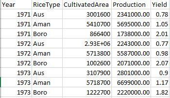

# Cleaning Bangladesh Rice Production Data
In this project, we are going to take a look at the production, import, and export of rice of Bangladesh.
You can download these datasets from [here](https://github.com/WahiduzzamanKhan/Cleaning-Bangladesh-Rice-Production-Data/tree/master/raw%20data). These data are collected from BRRI (Bangladesh Rice Research Institute) and WRS (World Rice Statistics).

## Loading the required packages
First, we are going to load all the packages that we are going to use:

```{r, warning=FALSE}
library(dplyr)
library(tidyr)
library(stringr)
library(readr)
library(readxl)
```

## Importing Rice Production data
As all the packages are loaded, it's time to read in the data. The first data file that we are going to read is the "rice production.xlsx". Opening this excel file we can see that there are 10 columns containing information about the cultivated area, production and yield of the three variants of rice (Aus, Amman, Boro) for the years 1971 to 2017. Let's import this file and store it as "RiceProduction".

```{r}
RiceProduction <- read_excel("raw data/rice production.xlsx", skip = 2, col_names = F)
```

While Importing the data I skipped the first two rows because of their formatting. The way those two rows are formatted, they are going to make a mess if they are imported. I also specified that the imported rows do not contain column names. So now let's take a look at the imported data.

```{r}
glimpse(RiceProduction)
```

## Cleaning Rice Production data
We can see that the is imported correctly, but the names of the variables are randomly given and this kind of names makes the data hard to work with. So let's give them appropriate names that explain what information they contain.

```{r}
colnames(RiceProduction) <- c("Year", "AreaAus", "AreaAman", "AreaBoro", "ProAus", "ProAman", "ProBoro", "YieldAus", "YieldAman", "YieldBoro")
RiceProduction
```
``

Taking a look at the dataset we can see that the data is not in tidydata format. The here isi wide and to make it tidy we have to make it long. After the transformation the data set should look like this:



To achieve this we divide this dataset into three datasets, each containing information about only one type of rice.
```{r}
# creating Aus dataset only taking columns about aus
Aus <- RiceProduction[,c(1,2,5,8)] 
# creating new RiceType column in Aus
Aus <- Aus %>% mutate(RiceType = "Aus")
# giving the columns appropriate names
names <- c("Year", "CultivatedArea", "Production", "Yield", "RiceType")
colnames(Aus) <- names 
# reordering the columns
order <- c("Year", "RiceType", "CultivatedArea", "Production", "Yield")
Aus <- Aus %>% select(order)

Aus
```

Here we can see the Aus dataset is in tidydata format. Now, we repeat this process for Aman and Boro.
```{r}
Aman <- RiceProduction[,c(1,3,6,9)]
Aman <- Aman %>% mutate(RiceType = "Aman") 
colnames(Aman) <- names
Aman <- Aman %>% select(order)

Boro <- RiceProduction[,c(1,4,7,10)]
Boro <- Boro %>% mutate(RiceType = "Boro") 
colnames(Boro) <- names
Boro <- Boro %>% select(order)
```


Now we combine these three datasets together in our riginal RiceProduction dataset.
```{r}
RiceProduction <- full_join(Aus, Aman)
RiceProduction <- full_join(RiceProduction, Boro)
```


In this data set, the areas cultivated are expressed in 1000 hectors and produced amounts are expressed in 1000 tonnes. But for analysis, we want them to show the actual amount. So we have to multiply those columns by 1000.
```{r}
RiceProduction <- RiceProduction %>% 
    mutate(CultivatedArea = CultivatedArea*1000) %>%
    mutate(Production = Production*1000)
```


Now that we have the actual values, let's put our concentration on the Year column now. We can see it has a range of years instead of a single year. In this analysis, we are going to consider the lower bound as the year and remove the upper bound and make them integers. We accomplish this by running the following code:

```{r}
# separating lower bound and deleting upper bound
RiceProduction <- separate(RiceProduction, Year, c("Year"), sep = "-")
# making Year integer
RiceProduction$Year <- as.integer(RiceProduction$Year)
# sorting dataset according to Year
RiceProduction <- RiceProduction[order(RiceProduction$Year),]
RiceProduction
```

We can see the Year column has a single year in each row.</br>

## Importing Rice Import and Export Data
Now we are going to import the data from the "WRS.csv" file. It contains information about importing and exporting rice. We are going to store this dataset named as "RiceImEx".

```{r}
RiceImEx <- read_csv("raw data/WRS.csv")
RiceImEx
```

It is visible that the column "Variable" contains values that should have their own column. So we are going to use the following code to give each of the values of "Variable" column their own column and discard the "Country", "Source" and "Unit" column. Then, we are going to change the column names to match the naming convention we are following. Also, the export and import values are given in 1000 USD. So, to get actual value we are going to multiply them by 1000.

```{r}
RiceImEx <- spread(RiceImEx[,c(-1,-4,-6)], Variable, Value)
colnames(RiceImEx) <- c("Year", "ExportQuantity", "ExportValue", "ImportQuantity", "ImportValue")
RiceImEx$ExportValue <- RiceImEx$ExportValue * 1000
RiceImEx$ImportValue <- RiceImEx$ImportValue * 1000
RiceImEx <- RiceImEx[order(RiceImEx$Year),]
```


## Importing Rainfall Data
Now it is time to import data about rainfall from the file named "Rain.csv". This data is not about rice, but the cultivation and production of rice heavily depend on rain. Thus, rainfall data are very much relevant to this analysis. We are going to store this dataset named as "Rain".

```{r}
Rain <- read_csv("raw data/Rain.csv")
```

From this, we get a dataset that has 34 columns. The first column named "Station" represent the weather station from where we got the data. Then we have "Year", "Month", then more 31 columns representing days of the month. The last 31 columns contain the total amount of rainfall on that day. We are going to reshape this in a fashion so that, each day of a month gets a different row instead of a column.

```{r}
Rain <- gather(Rain, Day, RainFall, -Station, -Year, -Month)
```

The "Rainfall" column has "***" as value. In this case, it represents a missing value. For this study we are going to replace all the missing values by "0", assuming that it did not rain that day. Also, we are going to change this column from a character type to a numeric type.

```{r}
Rain$RainFall <- str_replace_all(Rain$RainFall, "^[*]+$", "0")
Rain$RainFall <- as.numeric(Rain$RainFall)
```

We have our "RiceProduction" data and "RiceImEx" data expressed in a yearly fashion. So we are going to transform our "Rain" data so that the "RainFall" column represents the total amount of rainfall in a year. We are also going to drop the "Station" column.

```{r}
Rain <- Rain[,c(2,5)] %>% group_by(Year) %>% mutate(Rain = sum(RainFall, na.rm = T))
Rain <- unique(Rain[,c(1,3)])
```

## Merging All Together
Now, as all of our datasets are loaded and cleaned, we are going to combine them in a single dataset and name it "RiceData".

```{r}
RiceData <- full_join(RiceProduction, RiceImEx, by = "Year")
RiceData <- full_join(RiceData, Rain, by = "Year")
```

## Saving Cleaned Data
We are going to save this cleaned data in CSV format.

```{r}
write_csv(RiceData, "cleaned data/CleanedRiceData.csv")
```

## Conclusion
Now we have a cleaned, tidy, data about the production, import, and export of rice in Bangladesh, ready to perform analysis on. We have also saved the cleaned dataset to use it in future if we need.